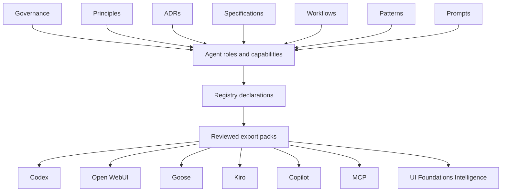

# Agents

## Purpose

This directory defines tool-independent agent role and capability guidance for UI Foundations.

It does not define runtime orchestration, vendor configuration, or implementation code.

## Canonical vs Derived

Canonical vault content in this area should define:

- role purpose, boundaries, and decision authority
- capability intent, inputs, outputs, and verification expectations
- references to governing workflows, patterns, prompts, and specifications

Derived content should define ecosystem-specific projections and packaging:

- export pack content under `exports/`
- consumer-repo integration instructions
- vendor/runtime-specific wrappers

When derived content conflicts with source documents, source documents and precedence win.

## Agent Role

An agent role is a bounded responsibility profile that combines one or more capabilities with explicit decision boundaries.

Role content should include:

- purpose
- responsibilities
- non-responsibilities
- inputs and outputs
- capabilities used
- decision authority
- operating boundaries
- required knowledge
- verification and escalation expectations

## Agent Capability

An agent capability describes what a role can reliably do, independent of tool vendor and runtime.

Capability content should follow the structure in `specification.document-structure` for `agent-capability`.

## Relationship to Other Vault Types

- **Workflows:** repeatable procedures; roles/capabilities should reference workflows rather than duplicating their step sequences.
- **Patterns:** reusable approaches; roles/capabilities may reference patterns for recurring reasoning or review strategies.
- **Prompts:** operational session starters; prompts are informative and should not introduce hidden governance.
- **Specifications:** normative requirements and constraints; roles/capabilities should defer to them when conflicts exist.
- **Registry and exports:** machine-readable declarations and derived projection packs for downstream consumption.

## Current Structure

- `roles/`: pilot role profiles
- `capabilities/`: pilot capability profiles
- `README.md`: architecture and contribution guidance

## Naming Rules

- Use lowercase kebab-case filenames.
- Use stable dot-separated IDs.
- Keep IDs tool-independent.
- Do not number files or folders.
- Do not embed vendor names in canonical agent IDs.

## Lifecycle Expectations

- Start new role/capability docs in `review` unless a higher-confidence basis exists.
- Promote to `accepted` or `stable` through normal governance review.
- Keep unresolved assumptions explicit.
- Use `related` references for traceability instead of duplicating source content.

## How to Add an Agent Role

1. Confirm the role has a distinct decision boundary and non-responsibility scope.
2. Reuse existing capabilities and workflows where possible.
3. Add a role profile in `agents/roles/`.
4. Add references to governing sources and linked capabilities.
5. Update `registry/agents.yml` relationships.

## How to Add a Capability

1. Confirm the capability is executor-independent and reusable.
2. Verify the concept is not already covered by workflow/pattern/prompt/specification.
3. Add a capability profile in `agents/capabilities/`.
4. Link to governing knowledge and related workflows/patterns/prompts.
5. Update `registry/agents.yml` references.

## Anti-Patterns

- Duplicating full workflow steps inside role/capability docs
- Embedding tool-specific config in canonical role/capability docs
- Defining new governance rules in prompts or index pages
- Introducing parallel taxonomy (`skills/`, `playbooks/`, `adapters/`) without approved governance change

## Recommended Starting Points

- `AGENTS.md`
- `governance/precedence.md`
- `governance/lifecycle.md`
- `specifications/document-structure.md`
- `specifications/vault-metadata.md`
- `registry/agents.yml`

