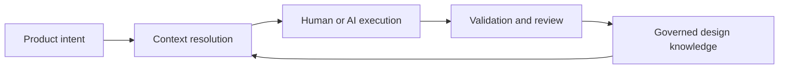

# AI Changes the Operating Context

## Generation changes the economics of ambiguity

Published engineering practice treats effective agent behavior as dependent on context, tools, and evaluation. The architectural principle advanced here is that design systems must make their knowledge governable before supplying it to agents. AI-assisted development lowers the cost of producing a plausible implementation; it does not automatically lower the cost of determining whether that implementation is correct. Missing context moves downstream into review, testing, rework, accessibility remediation, security analysis, and maintenance.

This changes the economics of design-system knowledge. A human engineer who cannot find a component guideline may pause, ask a colleague, or inspect adjacent implementations. An agent may confidently infer a pattern and continue across many files. The resulting output can be syntactically sound and visually close while still violating semantic, architectural, or governance constraints.

## Context is an engineering dependency

Anthropic defines context engineering as curating and maintaining the information available to a model, including system instructions, tools, external data, and conversation history. It argues that context is finite and that high-signal selection matters more than indiscriminately loading every possible source ([Anthropic, 2025](references.md#ref-anthropic-context)). This is directly relevant to design systems.

A design task may require only a subset of organizational knowledge: a governing principle, a component contract, applicable tokens, a composition pattern, content guidance, target-platform constraints, and tests. Loading the entire documentation estate can introduce conflicts and dilute attention. Loading only a component API can omit intent. A knowledge platform should enable progressive retrieval: begin with stable identifiers and summaries, then resolve the exact sources needed for the task.

The diagram is intentionally implementation-neutral. It does not assume that an agent owns the workflow. The same context-resolution step can support a designer, engineer, reviewer, static analyzer, or AI agent.

## Prompts are not a durable source of truth

Prompt engineering is useful for expressing a task, response shape, and immediate constraints. It is a poor substitute for governed organizational knowledge. Prompts are frequently copied, modified, and embedded in tools. They can become stale without an obvious owner. Long prompts also encourage duplication: the same accessibility or naming rule may be restated differently across many workflows.

Microsoft's content-engineering guidance treats system prompts as shared design artifacts that require clear roles, tasks, rules, examples, and cross-functional refinement ([Microsoft, 2026](references.md#ref-microsoft-content-engineering)). GitHub's support for repository and path-scoped instruction files similarly recognizes that persistent instructions belong near the work they constrain ([GitHub, 2025](references.md#ref-github-agents-md)). These practices improve operational guidance, but they do not make prompts normative.

The architectural principle proposed here is that prompts should reference governed knowledge. If a workflow needs the accessibility contract for a dialog, the source should be a versioned specification or standard mapping. The prompt should tell the agent to retrieve and apply it. When the specification changes, the organization updates one source and tests its consumers rather than locating every copied instruction.

## Agents need boundaries as much as examples

Examples show an agent what successful output can look like. Boundaries state what it must not infer. Anthropic recommends clear, self-contained tools and warns that ambiguous or overlapping capabilities create poor decision points for agents ([Anthropic, 2025](references.md#ref-anthropic-context)). The same principle applies to design knowledge.

A component contract should state required semantics, optional variants, prohibited combinations, ownership boundaries, and unresolved questions. A token specification should identify whether a name is public, internal, semantic, or provisional. A pattern should distinguish native-platform requirements from organization-specific preferences. A product exception should be local rather than silently mutating the system rule.

This is not about constraining all creativity. It is about separating agent freedom from system decisions. An agent can explore layout alternatives within an approved pattern while remaining unable to invent public token names or weaken keyboard behavior. Humans benefit from the same distinction because review can focus on intentional variation rather than rediscovering baseline requirements.

## AI makes provenance operational

When a human makes a design decision, reviewers can often ask why. When an agent produces hundreds of lines derived from retrieved sources, that reasoning may be harder to reconstruct. A knowledge platform should allow generated output to identify which specifications, patterns, decisions, and examples informed it.

Provenance need not expose private model reasoning. It can record inspectable inputs and outcomes:

- the identifiers and versions of applied knowledge;
- the task and target repository;
- validation performed;
- exceptions requested or granted;
- human reviewers; and
- unresolved assumptions.

This creates a practical audit trail without claiming that every output is deterministic. It also supports impact analysis. If a token contract or accessibility rule changes, maintainers can locate implementations and prompts that declared a dependency.

## Evaluation must cover behavior, not just appearance

Agent output can be assessed at several layers. Structural validation checks metadata, schemas, imports, and permitted names. Behavioral tests check states, interaction, and API contracts. Accessibility validation combines automated rules with keyboard, assistive-technology, and human evaluation. Visual regression checks rendering. Human review examines product appropriateness and trade-offs.

Anthropic's work on agent evaluations describes the value of combining code-based, model-based, and human graders, with criteria tailored to the task ([Anthropic, 2026](references.md#ref-anthropic-evals)). WCAG 2.2 similarly notes that broad accessibility evaluation requires both automated testing and human evaluation ([W3C, 2024](references.md#ref-wcag22)). A knowledge platform can connect each requirement to its expected evidence, making validation part of the contract rather than an afterthought.

AI increases the rate at which ambiguous knowledge can become production output. The appropriate response is not to freeze experimentation or centralize every decision, but to establish a clear chain from intent to governed context, execution, and validation. The next chapter defines the proposed knowledge platform model for that chain.
