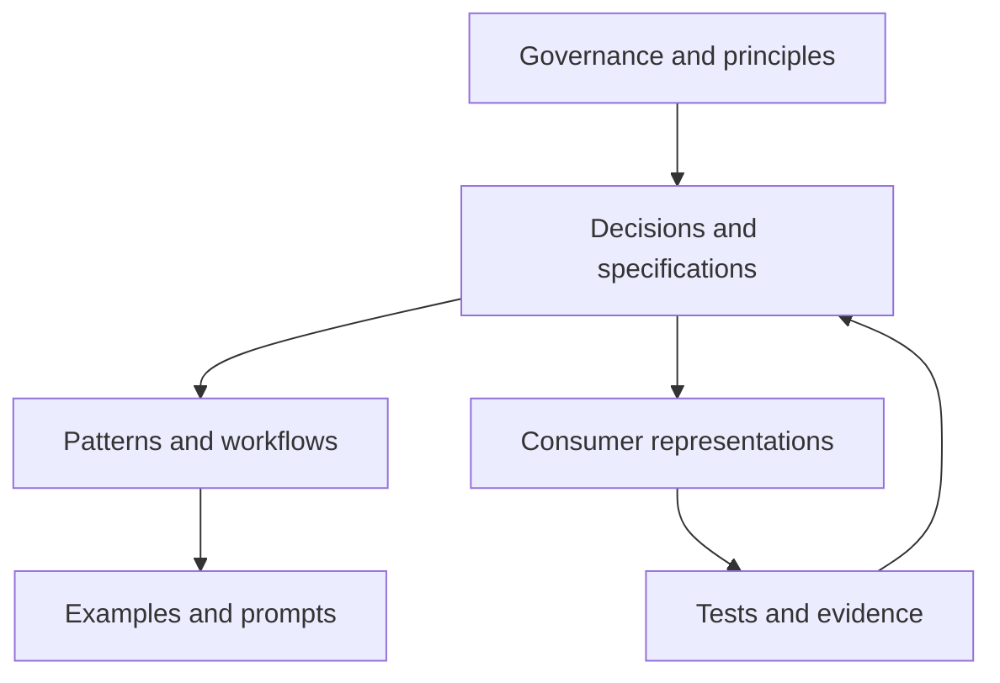

# A Knowledge Platform Model

## A proposal, not an industry standard

This model is a **UI Foundations proposal**, not an established standard or universal market phase. It describes an architectural expansion in which a design system manages reusable knowledge with the same care that mature systems apply to reusable interface assets.

The label is useful only if it makes a testable distinction:

1. A style system standardizes visual decisions.
2. A component system packages reusable interface implementation.
3. A knowledge platform connects assets to governed meaning, evidence, lifecycle, and multiple consumption paths.

Organizations do not need to replace earlier capabilities to adopt the third. Each layer depends on the previous layers continuing to work.

## The core properties of a knowledge platform

### Explicit authority

Every artifact should communicate whether it is normative, supporting, derived, or illustrative. A standards mapping should not be confused with the standard itself. A publication should not override a specification. An example should not silently become a requirement.

### Stable identity and relationships

Documents and assets need stable identifiers independent of file location or presentation tool. Relationships such as `governed_by`, `implements`, `depends_on`, and `supersedes` make the knowledge graph inspectable without requiring a proprietary graph database.

### Lifecycle and ownership

Draft, review, accepted, stable, deprecated, and archived states communicate how an artifact may be used. Ownership identifies stewardship without implying unilateral authority. Lifecycle enables agents and humans to prefer accepted sources and avoid deprecated guidance.

### Separation of canonical knowledge and implementation

The canonical layer defines meaning. Runtime repositories implement it. Design tools represent it. Documentation sites publish it. Agent instructions operationalize it. No single representation should redefine the source merely because it is convenient or popular.

### Validation and evidence

Normative claims should identify how they can be checked. Evidence may include tests, research, standards references, implementation reports, usability findings, or review records. Validation should be proportionate: a glossary entry does not need the same controls as an accessibility contract.

### Progressive disclosure

Knowledge should be concise at the point of discovery and detailed at the point of application. Summaries, metadata, and relationships help consumers retrieve relevant context without loading the entire corpus.

The upper chain represents precedence. Consumer representations remain downstream of decisions and specifications, while evidence can trigger reviewed changes without becoming governance by itself.

## What this model does not propose

It does not propose that every design-system artifact must become machine-readable JSON. Prose remains appropriate for rationale, principles, and nuanced guidance. It does not propose a universal component API, token taxonomy, repository layout, or orchestration framework. Those choices depend on platform and organizational context.

It also does not propose that all knowledge be centralized in one team. Canonical sources can be distributed if identity, ownership, precedence, and discovery are coherent. A component-specific decision may belong near its code; an ecosystem-wide principle may belong in a shared vault. The architecture should make the boundary visible.

Finally, it does not make AI the primary user. Human maintainability remains a quality requirement. Plain text, inspectable metadata, readable diffs, and ordinary review workflows are valuable precisely because they work for both people and machines.

## Indicators of maturity

A design system operating as a knowledge platform can be evaluated through operational questions rather than feature counts:

- Can a new team find the authoritative source for a decision?
- Can maintainers identify which implementations depend on a changed rule?
- Can a reviewer distinguish a standard from an organizational proposal?
- Can deprecated knowledge be excluded from default retrieval?
- Can an agent retrieve a bounded set of applicable constraints?
- Can the organization explain why a generated implementation was accepted?
- Can tools be replaced without losing canonical meaning?
- Can local lessons be promoted into durable guidance through review?

Public initiatives suggest parts of this direction. DTCG provides interoperable token data. Figma Code Connect establishes design-to-code mappings. Google DESIGN.md explores combined machine- and human-readable design context. Adobe's draft Design Data Specification explores registries, component metadata, documentation blocks, lifecycle, and agent access. GitHub applies persistent repository instructions to agents. None alone constitutes the model proposed here, and several are explicitly emerging. Together they show that structured design context is becoming an active engineering concern.

## The organizational consequence

Treating a design system as a knowledge platform changes investment decisions. Documentation is no longer a secondary publishing task; it is part of the system's operational data. Governance is not a gate at the end of delivery; it determines which knowledge can safely guide work. Design-system teams become stewards of interfaces between design intent, software architecture, standards, and product delivery.

This does not necessarily require a larger central team. It requires clear ownership and contribution paths. Distributed teams can author knowledge, specialists can review high-risk areas, and automation can validate structure. The system team maintains the framework and cross-cutting contracts rather than approving every product decision.

The proposed maturity model is therefore less about adding features than about making design knowledge durable. Components remain the executable center of many design systems; they stop being the outer boundary of what the system knows. The next chapter introduces UI Foundations only as a reference implementation used to test this proposal.
