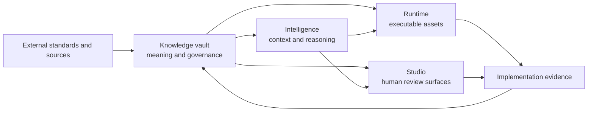

# UI Foundations

## A reference implementation of the model

UI Foundations is a reference implementation of the knowledge platform architecture proposed in this paper. It makes the proposal concrete; it is not evidence of industry consensus or the only valid implementation. Its current structure tests a hypothesis: separating canonical knowledge, reasoning and execution, runtime assets, and human-facing workspaces may improve clarity and tool independence.

The implementation uses four principal concerns:

- a **Vault** for canonical knowledge and governance;
- an **Intelligence** concern for context assembly, planning, and verification;
- a **Runtime** concern for executable tokens, components, patterns, and packages; and
- a **Studio** concern for human-facing exploration and review.

Integration boundaries connect these concerns to external standards, repositories, and tools. The names are project-specific. The separation of responsibilities is the architectural proposal.

## Why the knowledge layer is separate

Runtime repositories optimize for compilation, package distribution, framework compatibility, and testing. Knowledge repositories optimize for readability, provenance, relationships, and review. Combining them is possible, especially in smaller systems, but the responsibilities should remain conceptually distinct.

The Vault uses markdown and small machine-readable registries because they are inspectable, diffable, and broadly portable. Frontmatter gives each governed document identity, lifecycle, ownership, authority, and explicit relationships. A precedence model defines how conflicts are resolved. Specifications describe normative expectations; workflows and prompts operationalize them without acquiring higher authority.

This reflects the rationale behind lightweight architecture decision records: decision context and consequences should remain available alongside the systems they affect, in a form that supports review and history ([Fowler, 2026](references.md#ref-fowler-adr)). UI Foundations generalizes that idea beyond ADRs while preserving the distinction between document types.

## What the execution layer may do

An intelligence or execution layer can retrieve relevant knowledge, assemble task context, propose a plan, invoke tools, and verify results. It must not redefine canonical knowledge. If a retrieved prompt conflicts with a stable specification, the specification wins. If required knowledge is absent, the system should surface a gap rather than invent a durable rule.

This boundary is particularly important for AI agents. The execution layer can adapt context to a task and model, but canonical meaning remains tool-independent. An organization can replace a model, orchestration framework, or design tool without rewriting its principles and specifications.

## What the runtime layer owns

The runtime layer owns executable assets: packages, tokens, components, styles, tests, and implementation documentation. It is authoritative for what a released package actually does, but it is not automatically authoritative for why the ecosystem chose that behavior. Divergence between runtime and specification is treated as a detectable inconsistency, not resolved by assuming either side is always correct.

This distinction supports controlled feedback. A runtime experiment may reveal that a specification is incomplete. The lesson can be recorded, reviewed, and promoted into the knowledge layer. The implementation does not silently rewrite governance through precedent.

## What the Studio layer owns

The Studio concern makes knowledge and system state understandable to people. It may provide navigation, dependency views, review queues, playgrounds, or evidence dashboards. It is a projection over canonical sources rather than the exclusive place where knowledge exists.

This prevents a common portability failure: when the only meaningful representation lives inside a proprietary interface, migration risks losing rationale and relationships. A replaceable Studio can improve experience without owning meaning.

## Deliberate limitations

UI Foundations does not attempt to encode all design judgment. It does not claim that metadata quality guarantees content quality. It does not automate acceptance of governance changes. It also does not prescribe one universal taxonomy for every company.

The current reference model favors a small set of document types and explicit lifecycle states. That simplicity creates trade-offs. Authors must decide when knowledge is mature enough to become normative. Relationships require maintenance. Human review remains necessary, particularly for accessibility, product appropriateness, and cross-organizational decisions.

The model should be judged by practical outcomes: whether teams find authoritative guidance faster, whether implementation drift becomes more visible, whether agent output is easier to review, and whether the knowledge remains usable when tools change. Until such evidence accumulates, UI Foundations is an architectural probe rather than a proven operating model. The next chapters return to the general model, beginning with the standards that constrain any implementation.
