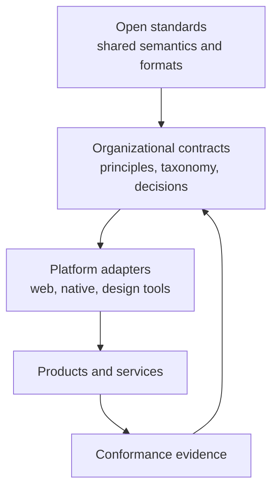

# Open Standards

## Standards define shared boundaries

This chapter concerns **established standards** and their published maturity, not UI Foundations proposals. Design systems operate between organizational intent and platform behavior. Open standards provide part of that boundary: HTML defines native elements, WCAG defines testable accessibility outcomes, WAI-ARIA defines accessibility semantics, and DTCG defines an exchange format for design-token data. A knowledge platform should reference these sources rather than paraphrase them into invisible local rules.

This principle protects both accuracy and portability. When an organization states that a component conforms to WCAG 2.2, reviewers should be able to trace that claim to the applicable success criteria and evidence. When a token file claims DTCG compatibility, tooling should validate the published format rather than a vendor-specific approximation.

Standards also have different maturity and authority. WCAG 2.2 is a W3C Recommendation. The WAI-ARIA Authoring Practices Guide is explicitly informative, even though it synthesizes normative standards into valuable patterns ([W3C, 2024](references.md#ref-wcag22); [W3C APG, 2026](references.md#ref-wai-apg)). The Design Tokens Format Module 2025.10 is a Design Tokens Community Group Final Report hosted by W3C; Community Group work does not automatically represent W3C Member consensus ([DTCG, 2025](references.md#ref-dtcg-format); [W3C, 2026](references.md#ref-w3c-dtcg)). A governed knowledge system should preserve these distinctions.

## Interoperability should focus on meaning

File compatibility is useful but insufficient. Two tools can parse the same JSON and still interpret names, modes, inheritance, or lifecycle differently. Durable interoperability requires agreement about semantics and explicit handling of extensions.

The DTCG format supports names, typed values, references, descriptions, and extensions. That is an appropriate foundation for token exchange. It does not standardize a company's semantic taxonomy, component model, review process, or accessibility policy. Those remain governed organizational knowledge.

This layered model avoids two opposite mistakes. The first is treating local conventions as universal standards. The second is assuming that standards remove the need for organizational decisions. WCAG can require that a control expose a programmatically determinable name and role; it cannot choose the product-specific label. DTCG can define how a color token is represented; it cannot decide whether the organization needs a particular semantic role.

## Open formats reduce strategic coupling

Human-readable text, documented schemas, stable identifiers, and exportable data reduce dependence on a single vendor. Google DESIGN.md's use of markdown plus YAML and Adobe's draft design-data work are relevant experiments because they treat design context as inspectable files ([Google, 2026](references.md#ref-google-design-md); [Adobe, 2026](references.md#ref-adobe-design-data)). Neither should be adopted uncritically: one is alpha and the other draft. Their value to this argument is directional. They demonstrate that design guidance, metadata, and machine-readable structures can coexist outside a closed canvas.

Open does not mean ungoverned. A permissive format can still carry private organizational knowledge, and an open-source repository still needs ownership, review, security, and release controls. The goal is replaceability: the ability to change authoring, publishing, retrieval, or execution tools without losing canonical meaning.

## A standards adoption discipline

Organizations can adopt standards more safely through four practices:

1. Record the exact source and maturity level.
2. Map standard concepts to local contracts without renaming the standard's meaning.
3. Validate conformance with documented evidence.
4. Revisit mappings when the standard or implementation changes.

Standards supply shared foundations, but they do not decide organizational policy. The next chapter addresses governance: the mechanism by which an organization turns standards, principles, and evidence into accountable choices.
