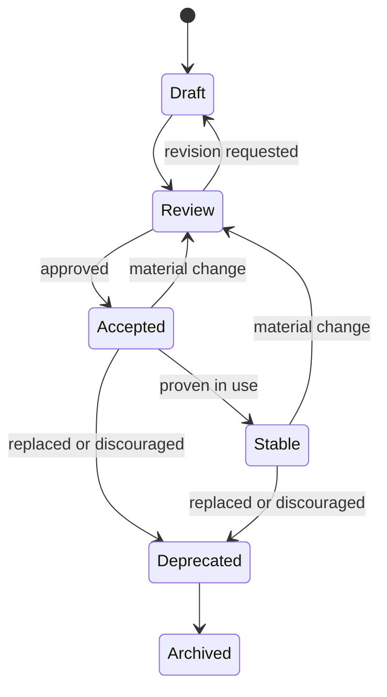

# Governance

## Governance is the control plane for meaning

The governance model in this chapter is an **architectural principle and UI Foundations proposal**, informed by published engineering practice rather than presented as an industry standard. Governance determines which knowledge can guide work, who may change it, how conflicts are resolved, and what evidence is required. In a component-centered design system, governance is visible through contribution processes, maintainers, release reviews, and deprecation notices. In a knowledge platform, those mechanisms also apply to principles, decisions, specifications, patterns, prompts, and mappings.

The objective is not centralized approval of every interface. Heavy governance can slow delivery and drive teams toward unofficial alternatives. The objective is a proportional control plane: high-impact normative changes receive deliberate review, while local and reversible decisions remain with product teams.

## Precedence prevents accidental policy

When all retrieved documents appear equally authoritative, polished examples or recent prompts can override durable decisions. A precedence model makes conflict resolution explicit. One possible order is governance, principles, accepted decisions, specifications, workflows, patterns, prompts, and examples. The exact taxonomy may vary, but the system should state it.

Publications such as this paper are informative. They can propose and synthesize, but they should not change normative contracts. Similarly, a prompt can operationalize a specification but should not create a hidden accessibility exception. This separation supports human review and safer AI retrieval.

## Lifecycle makes change legible

A lifecycle distinguishes exploration from authority. A draft may contain useful ideas without being safe for implementation. Review indicates readiness for evaluation. Accepted and stable sources can guide work. Deprecated and archived sources remain available for transition and history but should be excluded from default retrieval.

The diagram is a proposal, not a universal standard. Its purpose is to show that lifecycle is a state model with explicit transitions, not a date inferred from page freshness.

## Decisions require durable rationale

Architecture Decision Records provide a useful governance pattern. Martin Fowler describes ADRs as short records of a decision, its context, and significant consequences; when a decision changes, a new record supersedes the old rather than rewriting history ([Fowler, 2026](references.md#ref-fowler-adr)). The same practice can govern design-system architecture, naming contracts, public APIs, token layers, or contribution boundaries.

Not every choice deserves an ADR. The threshold should reflect blast radius, reversibility, and expected lifetime. A local spacing adjustment may need only product review. A public token rename affecting multiple platforms requires a recorded decision, migration plan, and impact analysis.

## Governance should be executable where possible

Rules that can be tested should not depend entirely on inspection. Schema validation can check required metadata and controlled values. Linters can detect unknown tokens or prohibited names. Contract tests can verify component states and API compatibility. Accessibility tests can cover deterministic requirements while leaving contextual evaluation to humans.

The architectural-fitness-function approach describes tests that evaluate how closely implementation aligns with intended architectural characteristics, enabling earlier and more continuous governance ([Fowler contributors, 2024](references.md#ref-fowler-fitness)). The principle applies to design systems: automate repeatable checks, but do not pretend that automation resolves research, ethics, content quality, or product suitability.

## Distributed contribution with accountable stewardship

Public systems demonstrate that contribution and quality controls can coexist. Carbon describes phased contributions for new components and allows broader community participation ([IBM Carbon, 2026](references.md#ref-carbon-contributing)). Spectrum emphasizes transparency through versioning, open issues, and checklists ([Adobe Spectrum, 2026](references.md#ref-spectrum-principles)). These are organization-specific implementations of a general principle: contribution paths should expose expectations before work is completed.

A knowledge platform can distribute authorship while retaining stewardship:

- domain teams own local evidence and implementation knowledge;
- system maintainers own cross-cutting contracts and taxonomy;
- specialists review accessibility, security, content, or platform concerns;
- architecture leadership resolves ecosystem-wide conflicts;
- product leadership retains responsibility for product outcomes.

AI agents may draft changes, run checks, and assemble impact reports. They should not unilaterally accept governance changes. Acceptance is an organizational decision because it changes what future consumers are permitted to treat as authoritative.

## Exceptions are governed knowledge

Exceptions are sometimes necessary. A global product may have regulatory, platform, brand, or domain constraints that do not fit the default. Hiding exceptions in local code makes the system appear more consistent than it is and encourages repeated rediscovery.

An exception record should identify scope, rationale, owner, expiry or review trigger, and the rule being varied. Repeated exceptions are evidence: they may reveal that the central contract is too narrow. Governance should enable that feedback without converting every exception into a universal feature.

## Metrics should measure outcomes and system health

Adoption counts alone can reward superficial use. More meaningful governance indicators include unresolved contract conflicts, time to find authoritative guidance, deprecation completion, accessibility defects escaping to production, duplicated implementations, review lead time, and the percentage of high-impact rules with verification evidence.

No single metric proves design-system value. Leadership should connect system health to product quality and delivery outcomes. Governance succeeds when teams make appropriate decisions with less ambiguity—not when every decision passes through a central team. The next chapter translates these controls into a logical reference architecture.
