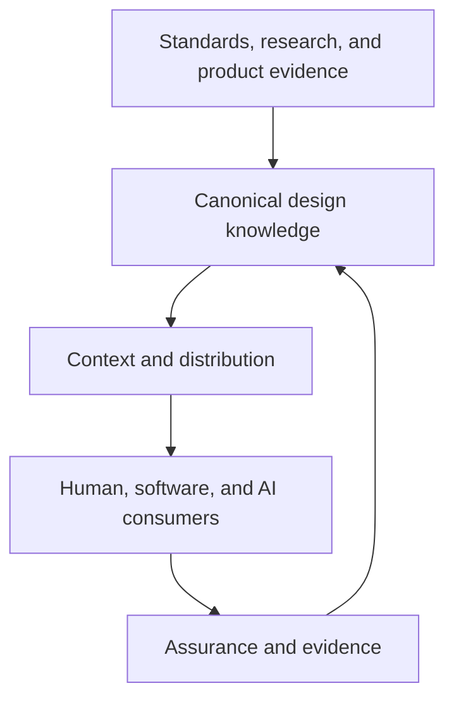

# Reference Architecture

## Architectural goals

The reference architecture is a **UI Foundations proposal** that translates the paper's principles into separable capabilities. It is technology-neutral. An organization may implement several capabilities in one repository or distribute them across services and tools. Alignment with the proposal depends on responsibility boundaries, not deployment topology.

The architecture has six goals:

1. preserve canonical design knowledge independently of presentation tools;
2. expose authority, ownership, lifecycle, and provenance;
3. serve humans, deterministic software, and AI agents;
4. keep runtime implementation replaceable and testable;
5. support distributed contribution with controlled promotion; and
6. turn implementation evidence into reviewed knowledge.

## Logical layers

### Source adapters

Source adapters connect external standards, research, and local product evidence to the canonical layer. They should preserve source identity and maturity. A WCAG mapping cites the Recommendation and applicable criterion. A DTCG adapter records the report version. A usability finding records method and scope. Adapters do not upgrade evidence into policy automatically.

### Canonical knowledge

The canonical layer stores durable meaning. It includes governance, principles, decisions, specifications, patterns, terminology, and registries. Documents may combine structured metadata with prose. Stable identifiers allow relationships to survive path changes.

The layer needs a discovery mechanism but not necessarily a graph database. A file index can be sufficient for a modest corpus. Larger organizations may build search, graph, or vector projections, provided those projections remain derived and can be rebuilt from canonical sources.

### Context resolution

Context resolution selects relevant knowledge for a consumer and task. It applies scope, lifecycle, precedence, and dependency rules. A design review may retrieve principles, product constraints, and research evidence. A code-generation task may retrieve a component contract, token mappings, accessibility requirements, and validation workflow.

The output should include source identifiers and unresolved conflicts. Retrieval confidence must not be mistaken for source authority. This follows the context-engineering principle that useful agent context is selected rather than maximized ([Anthropic, 2025](references.md#ref-anthropic-context)).

### Runtime assets and tool representations

Runtime assets include token packages, components, styles, schemas, and tests. Design-tool representations include libraries, variables, annotations, and component mappings. Documentation surfaces publish guidance for particular audiences. Each is a consumer and potential evidence source.

Figma Code Connect is an example of an explicit representation mapping: it connects a design component to production code ([Figma, 2024](references.md#ref-figma-code-connect)). DTCG token files provide a standardized exchange boundary ([DTCG, 2025](references.md#ref-dtcg-format)). These mechanisms fit within the architecture but do not define the canonical layer by themselves.

### Agent workflows

Agent workflows combine instructions, tools, and resolved knowledge. They may draft specifications, generate implementation, review changes, or collect evidence. Prompts remain operational artifacts. Their authority comes from the governed sources they invoke.

Tool permissions should follow least privilege. Read-only retrieval should be distinct from repository writes, releases, or external communication. High-impact actions require deterministic validation and human authorization appropriate to organizational risk.

### Assurance and learning

Assurance combines automated checks and human judgment. Structural validators can inspect metadata and relationships. Contract tests can check runtime behavior. Visual and accessibility testing can identify regressions. Reviewers assess intent, usability, and exceptions.

Failures and discoveries become lessons or proposals. Promotion into canonical knowledge requires review. This creates a feedback loop without treating every implementation detail as a durable rule.

## A minimum viable implementation

An organization does not need all capabilities at once. A minimum implementation can use:

- version-controlled markdown with required metadata;
- a small document taxonomy and precedence model;
- stable identifiers and explicit relationships;
- a root index and domain indexes;
- schemas or scripts for metadata and link validation;
- mappings from a few critical components to code and standards; and
- a review process for promoting lessons into specifications.

This foundation can support ordinary human workflows before AI is introduced. Agent access should be added only after authoritative sources and boundaries are sufficiently clear.

## Security and privacy boundaries

Knowledge platforms may contain sensitive roadmaps, internal research, unreleased brand assets, or security-relevant implementation detail. Open formats do not imply public access. Retrieval must respect repository permissions, data classification, and consumer scope.

Agents create additional prompt-injection and data-exfiltration risks when they retrieve external content or invoke tools. The canonical layer should distinguish trusted internal governance from untrusted retrieved material. External text can provide evidence; it cannot override local authority merely because it appears in context.

## Architectural trade-offs

The model introduces maintenance cost. Metadata can drift, relationships can become stale, and authors can over-classify documents. Central repositories can distance knowledge from implementation, while fully distributed sources can weaken discovery. These are not arguments against the architecture; they are constraints to manage.

The smallest effective design is preferable. Use plain files until scale justifies additional infrastructure. Automate validation before adding elaborate authoring interfaces. Keep authoritative sources concise and link to evidence. The next chapter explains why an open-source reference implementation can make these architectural assumptions inspectable without making openness a requirement of the model.
