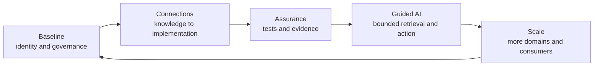

# Roadmap

## Adoption should be incremental

This roadmap is a **UI Foundations proposal**, not a prescribed industry sequence. A knowledge platform should evolve from demonstrated needs rather than begin as a large transformation program. Establish governance and identity first, connect a small set of high-value artifacts, and expand only when evidence shows that the model reduces ambiguity or rework.

## Phase 1: establish the knowledge baseline

Inventory existing principles, decisions, specifications, component guidance, tokens, contribution rules, and standards mappings. Do not migrate everything immediately. Identify authoritative sources, duplicates, contradictions, and owner gaps.

Define a minimal taxonomy, lifecycle, precedence model, and identifier convention. Create a root index. Validate required metadata and relative links. Select a small pilot domain with active delivery work and meaningful cross-functional dependencies.

Success criteria include:

- owners can identify the governing source for pilot decisions;
- duplicate or conflicting guidance is visible;
- draft knowledge is distinguishable from accepted knowledge; and
- the corpus remains readable without specialized tooling.

## Phase 2: connect knowledge to implementation

Map pilot specifications and patterns to runtime components, tokens, tests, and design assets. Prefer explicit relationships over name matching. Record which source owns semantics and which representation implements them.

Use established standards where applicable. Token exchange should align with the DTCG format where practical. Web accessibility mappings should cite WCAG and relevant WAI-ARIA material. Deviations should be documented rather than hidden in adapters.

Success criteria include:

- a changed rule produces an inspectable impact list;
- component documentation links to applicable standards and tests;
- deprecated assets point to replacements; and
- design-to-code mappings are reviewed and versioned.

## Phase 3: add continuous assurance

Introduce schema validation, relationship checks, contract tests, accessibility checks, and documentation verification. Treat automation as evidence, not as a complete quality judgment.

Define review triggers by risk. A public API change may require architecture and consumer review. An editorial clarification may require only owner review. Track exceptions and unresolved questions.

## Phase 4: introduce bounded agent workflows

Begin with read-only discovery and review assistance. Agents can summarize applicable sources, identify missing metadata, or compare implementation with specifications. Require source citations in outputs.

Progress to repository changes only when validation and permissions are established. Agent workflows should retrieve accepted knowledge by default, identify assumptions, and stop when governance is missing. Keep human approval for changes to normative sources and high-impact releases.

Success criteria should measure review quality and correction cost, not generated volume. Useful indicators include fewer repeated deviations, shorter time to locate constraints, and higher traceability of accepted changes.

## Phase 5: scale through federation

As adoption grows, allow domain repositories to own local knowledge while publishing governed indexes or export packs. Preserve stable identifiers and shared relationship semantics. Avoid forcing every domain into one content model when its risks differ.

At this stage, richer search, graph projections, or context services may be justified. They should remain rebuildable from canonical sources. Tool adoption should follow demonstrated retrieval and governance needs.

## Research questions

Several assumptions require empirical review:

- Which metadata fields materially improve human discovery rather than only machine retrieval?
- How much relationship maintenance can be automated without producing false confidence?
- Which design decisions benefit from formal records, and which become bureaucracy?
- How should context packages be evaluated across different models and tasks?
- What evidence demonstrates that agent-assisted design-system work improves product outcomes?
- How should organizations measure the cost of stale or contradictory knowledge?

## Failure modes to avoid

The roadmap can fail through over-centralization, premature tooling, or weak stewardship. A central team that must approve every contribution becomes a bottleneck. A graph or AI interface built before identifiers and ownership are stable makes inconsistency easier to query without making it easier to resolve. A migration that copies old documentation without reviewing authority preserves the original fragmentation in a new location.

Another failure mode is measuring activity instead of outcomes. Document count, generated code volume, and agent sessions can rise while product quality remains unchanged. Each phase should have an exit criterion tied to decision quality, traceability, conformance, or correction cost.

Finally, organizations should avoid declaring the platform complete. Standards, products, and tools evolve. The architecture must support deprecation, supersession, and controlled experimentation. Evolutionary architecture treats change as continuous work rather than evidence that the original design failed ([Fowler, 2017](references.md#ref-fowler-evolutionary)).

## Leadership decisions

Design and engineering leadership should decide whether the design system is expected to govern only reusable assets or also the knowledge required to apply them. Architecture leadership should define boundaries between canonical knowledge, runtime truth, and tool projections. Product leadership should ensure that system adoption remains connected to customer outcomes.

The immediate next step is not to build a universal platform. It is to select one consequential workflow, make its knowledge and authority explicit, connect it to implementation and evidence, and measure whether the result improves decision quality. The architecture should earn its expansion.

## Conclusion

Design systems have become durable production infrastructure because they make selected design and engineering decisions reusable. Components, design tokens, patterns, and documentation remain the foundation of that value. The next generation must standardize design knowledge, not only reusable components, so that people and machines can find, interpret, apply, and verify the knowledge that gives each asset meaning.

AI makes this constraint visible because it can turn incomplete context into implementation at high speed. The appropriate response is neither unrestricted generation nor an attempt to encode every judgment. It is a governed knowledge architecture that distinguishes standards from observations, normative contracts from examples, and organizational proposals from established practice. Such an architecture supplies stable identity, provenance, lifecycle, precedence, explicit relationships, and validation while leaving product decisions with accountable humans.

The proposed model is deliberately layered. Open standards define shared boundaries. Canonical organizational knowledge records intent and decisions. Runtime and design tools implement that knowledge through replaceable representations. Context resolution supplies bounded guidance to humans, automation, and agents. Tests, review, and product evidence return learning to the system through a controlled promotion path.

This model will not remove disagreement. Design leadership will still balance coherence with expression. Engineering leadership will still balance reuse with local constraints. Architecture will still decide where coupling is justified. Product teams will still own outcomes. The platform's purpose is to make those decisions more legible and less likely to be replaced by accidental precedent.

UI Foundations offers one reference implementation with a separated knowledge vault, execution concern, runtime, and human-facing workspace. Its value must be established through use. The project should remain open to smaller repository structures, different taxonomies, and alternative tools that preserve the same responsibility boundaries.

The practical test is straightforward. When a new team or agent is asked to create or change an experience, can it identify the applicable standards, understand the organization's intent, find the correct implementation assets, recognize what remains undecided, and produce evidence that the result is acceptable? If the answer depends on locating the right person or copying the nearest example, the design system still contains critical tacit knowledge. Turning that knowledge into a governed, human-readable, and machine-usable platform is the work beyond components.

The measure of progress is not how much knowledge is stored, but how reliably relevant knowledge improves decisions and outcomes.
