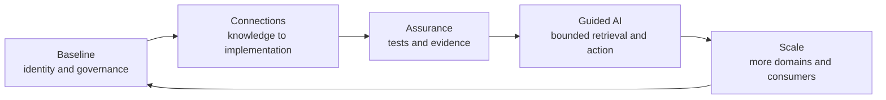

# Roadmap

## Adoption should be incremental

The roadmap is a **UI Foundations proposal**, not a sequence every organization needs to follow. A knowledge platform should evolve from demonstrated needs rather than begin as a large transformation program. Begin with a small, governed set of documents. Connect them to implementation, then expand only if the pilot reduces ambiguity or rework.

## Phase 1: establish the knowledge baseline

Inventory existing principles, decisions, specifications, component guidance, tokens, contribution rules, and standards mappings. Do not migrate everything immediately. Identify authoritative sources, duplicates, contradictions, and owner gaps.

Define a minimal taxonomy, lifecycle, precedence model, and identifier convention. Create a root index. Validate required metadata and relative links. Select a small pilot domain with active delivery work and meaningful cross-functional dependencies.

Success criteria include:

- owners can identify the governing source for pilot decisions;
- duplicate or conflicting guidance is visible;
- draft knowledge is distinguishable from accepted knowledge; and
- the corpus remains readable without specialized tooling.

## Phase 2: connect knowledge to implementation

Map pilot specifications and patterns to runtime components, tokens, tests, and design assets. Prefer explicit relationships over name matching. Record which source owns semantics and which representation implements them.

Use established standards where applicable. Token exchange should align with the DTCG format where practical. Web accessibility mappings should cite WCAG and relevant WAI-ARIA material. Deviations should be documented rather than hidden in adapters.

Success criteria include:

- a changed rule produces an inspectable impact list;
- component documentation links to applicable standards and tests;
- deprecated assets point to replacements; and
- design-to-code mappings are reviewed and versioned.

## Phase 3: add continuous assurance

Introduce schema validation, relationship checks, contract tests, accessibility checks, and documentation verification. Treat automation as evidence, not as a complete quality judgment.

Define review triggers by risk. A public API change may require architecture and consumer review. An editorial clarification may require only owner review. Track exceptions and unresolved questions.

```mermaid
flowchart LR
    B["Baseline<br/>identity and governance"] --> C["Connections<br/>knowledge to implementation"]
    C --> A["Assurance<br/>tests and evidence"]
    A --> G["Guided AI<br/>bounded retrieval and action"]
    G --> S["Scale<br/>more domains and consumers"]
    S --> B
```

## Phase 4: introduce bounded agent workflows

Begin with read-only discovery and review assistance. Agents can summarize applicable sources, identify missing metadata, or compare implementation with specifications. Require source citations in outputs.

Progress to repository changes only when validation and permissions are established. Agent workflows should retrieve accepted knowledge by default, identify assumptions, and stop when governance is missing. Keep human approval for changes to normative sources and high-impact releases.

Success criteria should measure review quality and correction cost, not generated volume. Useful indicators include fewer repeated deviations, shorter time to locate constraints, and higher traceability of accepted changes.

## Phase 5: scale through federation

As adoption grows, allow domain repositories to own local knowledge while publishing governed indexes or export packs. Preserve stable identifiers and shared relationship semantics. Avoid forcing every domain into one content model when its risks differ.

At this stage, richer search, graph projections, or context services may be justified. They should remain rebuildable from canonical sources. Tool adoption should follow demonstrated retrieval and governance needs.

## Research questions

Several assumptions require empirical review:

- Which metadata fields materially improve human discovery rather than only machine retrieval?
- How much relationship maintenance can be automated without producing false confidence?
- Which design decisions benefit from formal records, and which become bureaucracy?
- How should context packages be evaluated across different models and tasks?
- What evidence demonstrates that agent-assisted design-system work improves product outcomes?
- How should organizations measure the cost of stale or contradictory knowledge?

## Failure modes to avoid

Three risks recur: centralizing too many decisions, building tools before the underlying knowledge is reliable, and leaving ownership unclear. A central team that must approve every contribution becomes a bottleneck. A graph or AI interface built before identifiers and ownership are stable makes inconsistency easier to query without making it easier to resolve. A migration that copies old documentation without reviewing authority preserves the original fragmentation in a new location.

Activity metrics can also hide a lack of progress. Document count, generated code volume, and agent sessions can rise while product quality remains unchanged. Each phase should have an exit criterion tied to decision quality, traceability, conformance, or correction cost.

The work also needs room to change. Standards, products, and tools evolve. The architecture must support deprecation, supersession, and controlled experimentation. Evolutionary architecture treats change as continuous work rather than evidence that the original design failed ([Fowler, 2017](references.md#ref-fowler-evolutionary)).

## Leadership decisions

Design and engineering leadership should decide whether the design system is expected to govern only reusable assets or also the knowledge required to apply them. Architecture leadership should define boundaries between canonical knowledge, runtime truth, and tool projections. Product leadership should ensure that system adoption remains connected to customer outcomes.

Select one consequential workflow, record its governing knowledge, connect that knowledge to implementation and tests, and measure whether decisions improve. Expand the architecture only when the results justify it.

## Conclusion

A design system can already share components, tokens, and patterns across products. What remains harder to reuse is the reasoning behind them: which decisions govern an experience, where an exception is allowed, and how a team can tell whether an implementation is correct.

AI makes this gap easier to see. It can turn incomplete instructions into working code before anyone has resolved missing semantics or ownership. The response proposed here is a knowledge layer that records standards, decisions, provenance, lifecycle, relationships, and validation criteria. Execution tools consume this knowledge; they do not become its source of authority.

UI Foundations tests that separation through a Vault, an Intelligence layer, a Runtime, and a Studio. It is an experiment, not evidence that four repositories are the right structure for every team. Human judgment is still needed to resolve trade-offs and approve durable changes.

The useful question for a pilot is whether a new team or agent can find the relevant standards, understand the intent, select maintained assets, identify open decisions, and show evidence of an acceptable result. If the answer depends on finding the right colleague or copying the nearest example, critical knowledge is still difficult to reuse. The measure of progress is fewer avoidable errors and clearer decisions, not more documents.
